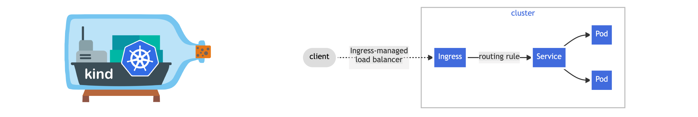
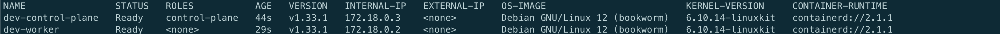
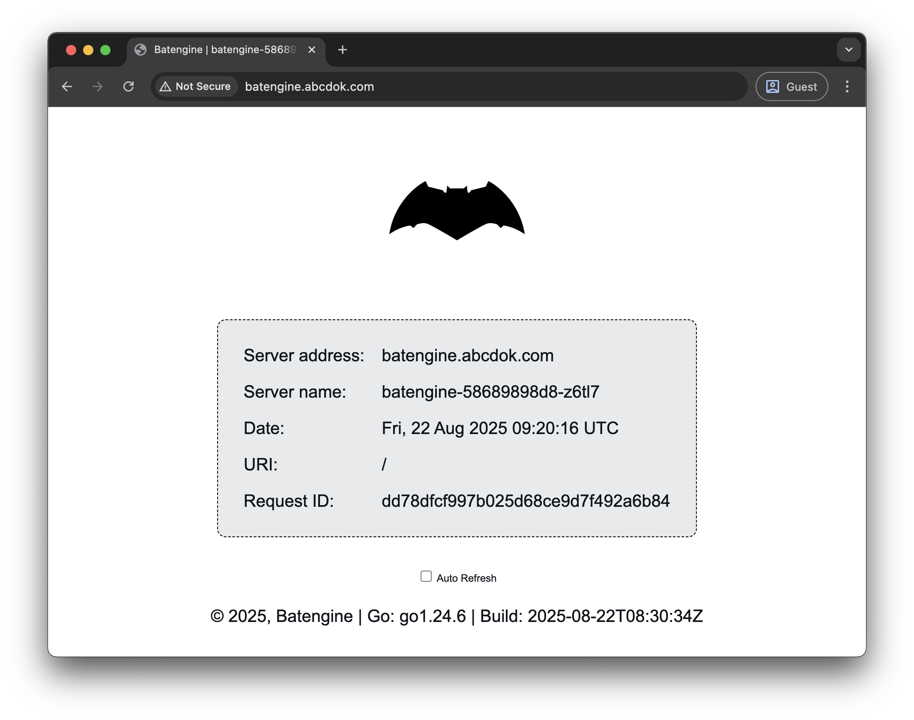

<p align="center">
  
</p>

<h1 align="center">Kind Kubernetes Ingress Cluster</h1>

> [!IMPORTANT]
> If you discover a security vulnerability, please do the responsible thing, 
> **Privately report it** to me at [satyabrata.7059@gmail.com](mailto:satyabrata.7059@gmail.com)
>

<p align="center">
  <a href="https://github.com/batpool/kubernetes-kind-ingress/blob/master/LICENSE">
    
  </a>
  <a href="https://github.com/batpool/kubernetes-kind-ingress/blob/master/CODE_OF_CONDUCT.md">
    
  </a>
  <a href="https://github.com/batpool/kubernetes-kind-ingress/blob/master/SECURITY.md">
    
  </a>
</p>

<p align="center">
  
  
  
</p>

<details>
<summary><strong>📁 Table of Contents</strong></summary>

- [📊 Screenshot](#-screenshot)
- [🛠️ Step-by-Step Installation Guide](#️-step-by-step-installation-guide)
  - [🖥️ macOS (via Homebrew)](#️-macos-via-homebrew)
  - [🐧 Ubuntu / Linux](#-ubuntu--linux)
  - [🧬 Clone the Repository](#-clone-the-repository)
  - [🧱 Create Kind Cluster](#-create-kind-cluster)
  - [📦 Install ingress controller](#-install-ingress-controller)
  - [🔧 Deploy the app](#-deploy-the-app)
  - [🌐 Configure hostname for ingress](#-configure-hostname-for-ingress)
  - [🌐 Access at](#-access-at)
- [🔐 Security](#-security)
- [📜 Code of Conduct](#-code-of-conduct)
- [⚖️ License](#-license)

</details>

---

```code
+-------------------+
|   Client (User)   |
| curl / Browser    |
+---------+---------+
          |
          v
+-------------------+
|   localhost:80    |
|   (hostPort:80)   |
+---------+---------+
          |
          v
+-------------------+
|  kind Node (VM)   |
| extraPortMapping  |
| 80 -> 31007       |
+---------+---------+
          |
          v
+---------------------------+
| Ingress-Nginx Service     |
| Type: NodePort            |
| 31007 -> targetPort: 80   |
+-------------+-------------+
              |
              v
+---------------------------+
| Ingress-Nginx Controller  |
| Pod (Deployment)          |
| Applies Ingress Rules     |
+-------------+-------------+
              |
              v
+---------------------------+
|  App Service (ClusterIP)  |
|  name: batengine          |
|  port: 80 -> 8080         |
+-------------+-------------+
              |
              v
+---------------------------+
|  Backend Pod              |
|  batengine container      |
|  running on :8080         |
+---------------------------+

```

## 📊 Screenshot



## 🛠️ Step-by-Step Installation Guide

### 🖥️ macOS (via Homebrew)

```bash
# Install Homebrew (if not already installed)
/bin/bash -c "$(curl -fsSL https://raw.githubusercontent.com/Homebrew/install/HEAD/install.sh)"

# Install kind (Kubernetes in Docker)
brew install kind

# Install kubectl (Kubernetes CLI)
brew install kubectl

```

### 🐧 Ubuntu / Linux

```bash
# Install kind
# For AMD64 / x86_64
[ $(uname -m) = x86_64 ] && curl -Lo ./kind https://kind.sigs.k8s.io/dl/v0.29.0/kind-linux-amd64
# For ARM64
[ $(uname -m) = aarch64 ] && curl -Lo ./kind https://kind.sigs.k8s.io/dl/v0.29.0/kind-linux-arm64
chmod +x ./kind
sudo mv ./kind /usr/local/bin/kind

# Install kubectl (based on system architecture)
ARCH=$(uname -m)
if [ "$ARCH" = "x86_64" ]; then
  KARCH=amd64
elif [ "$ARCH" = "aarch64" ]; then
  KARCH=arm64
else
  echo "❌ Unsupported architecture: $ARCH"
  exit 1
fi

curl -LO "https://dl.k8s.io/release/$(curl -s https://dl.k8s.io/release/stable.txt)/bin/linux/${KARCH}/kubectl"
chmod +x kubectl
sudo mv kubectl /usr/local/bin/kubectl

```

### 🧬 Clone the Repository

Start by cloning the project to your local machine:

```bash
git clone https://github.com/batpool/kubernetes-kind-ingress.git
cd kubernetes-kind-ingress
```

### 🧱 Create Kind Cluster

```bash
kind create cluster --config kind/config.yaml --name dev
```

### 📦 Install ingress controller

```bash
kubectl apply --server-side -f https://raw.githubusercontent.com/kubernetes/ingress-nginx/controller-v1.13.1/deploy/static/provider/kind/deploy.yaml

# patch ingress
kubectl patch svc ingress-nginx-controller \
  -n ingress-nginx \
  --type='json' \
  -p='[{"op":"replace","path":"/spec/ports/0/nodePort","value":31007}]'
```

### 🔧 Deploy the app

```bash
kubectl apply -f ./manifest
```

### 🌐 Configure hostname for ingress

```bash
# add below to /etc/hosts
sudo vim /etc/hosts

# add below line at end
127.0.0.1       batengine.abcdok.com
```


### 🌐 Access at

```bash
http://batengine.abcdok.com
```

<a href="#copyright-and-license">
  <h2 id="copyright-and-license">Copyright and License</h2>
</a>

This project is licensed under the [MIT License](LICENSE).

---


> 🌟 *Don’t forget to give a ⭐ on GitHub if you find this project helpful!*